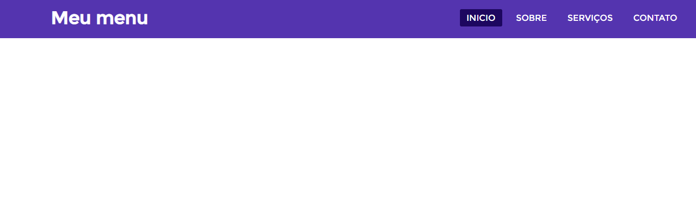
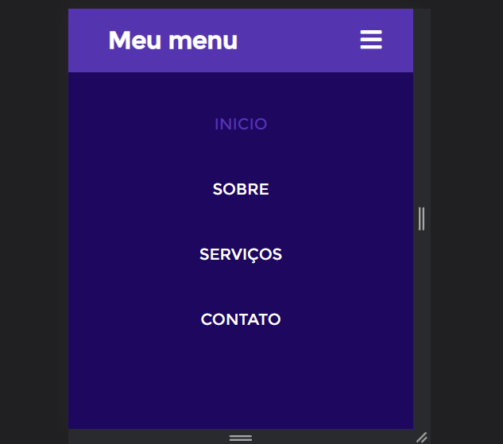

Menu responsivo simples feito em HTML5 e CSS3. Foi aprendido vários conceitos de formatações do CSS, como direcionar os elementos do menu para o lado direito, o conceito da responsivade em si e suas formatações para deixar o menu responsivo.

Tecnologias usadas: HTML5 e CSS3.

